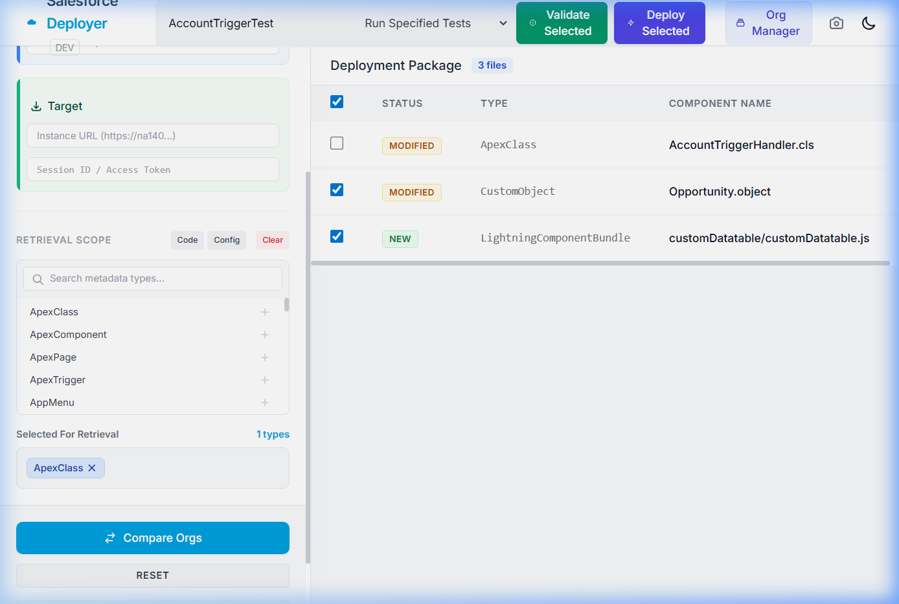
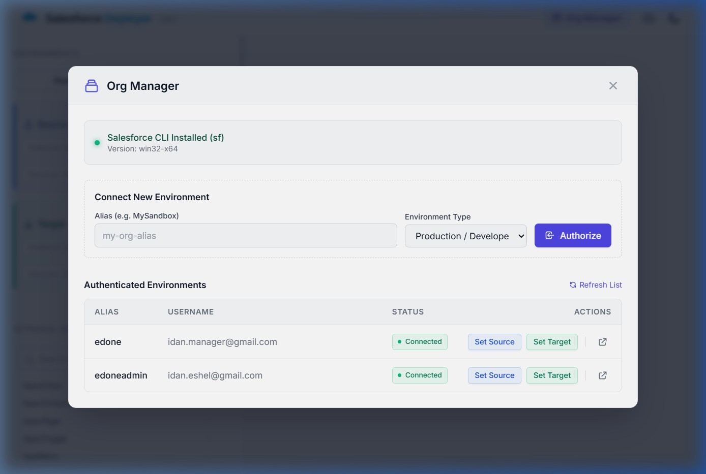
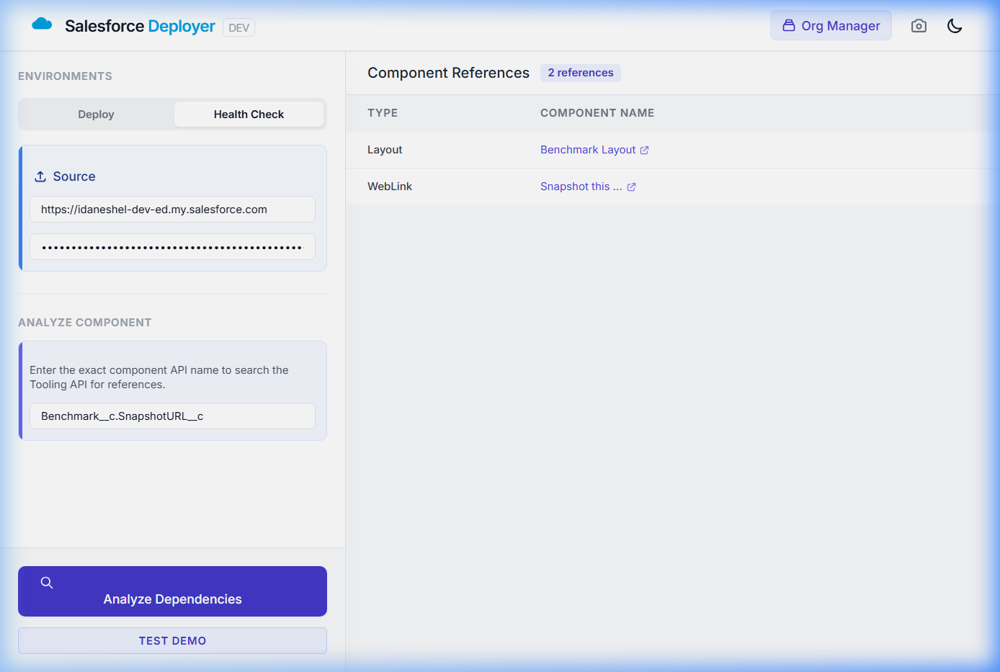

# Salesforce Metadata Deployer

A stateless proxy for comparing and deploying Salesforce metadata using Heroku's Eco tier. 

## 🚀 TL;DR: What's New
- **🍒 Cherry-picking**: Select specific files to deploy from the fetched or compared package.
- **⚙️ Test Levels**: Choose testing strictness (e.g., `RunLocalTests`, `RunSpecifiedTests`) directly from the UI dropdown.
- **✅ Check-Only (Validation)**: Use the 'Validate Selected' button to simulate a deployment and test run without modifying the target org.
- **🔑 Org Manager**: Seamlessly connect to your Salesforce environments using your existing local `sf` (Salesforce CLI) configuration. 
- **🏥 Field Usage & Health Check**: Analyze dependencies for custom fields and other metadata natively. View where components are used and open their Salesforce Setup pages directly in one click.

### Validation & Deployment


### Environment Selection (Org Manager)


### Dependency Analyzer (Field Usage)


## Features
- **Stateless Proxy**: FastAPI streams large XML and Base64 ZIP payloads directly between Salesforce and the browser without saving anything to the Heroku filesystem.
- **Client-Side Processing**: Browser uses JSZip and diff2html to compare metadata before deployment.
- **Modern UI**: Built with Tailwind CSS, featuring Dark Mode.

## Deploying to Heroku

This project is configured to be deployed easily to Heroku.

[](https://heroku.com/deploy)

If you are deploying manually via the Heroku CLI:

```bash
heroku create sfdc-deployer
git push heroku main
```

## Running Locally

1. Create a virtual environment:
```bash
python -m venv venv
source venv/bin/activate  # On Windows: venv\Scripts\activate
```

2. Install dependencies:
```bash
pip install -r requirements.txt
```

3. Run the development server:
```bash
uvicorn app:app --reload
```

## Security Note

This tool proxies your Salesforce Session IDs. For production environments, ensure you use HTTPS, and never expose your target instance URLs or session IDs in logs.
